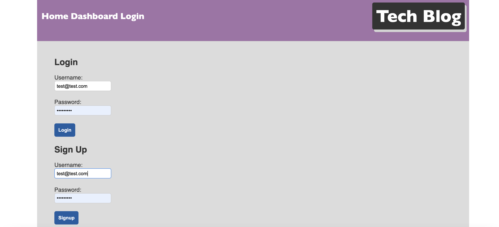
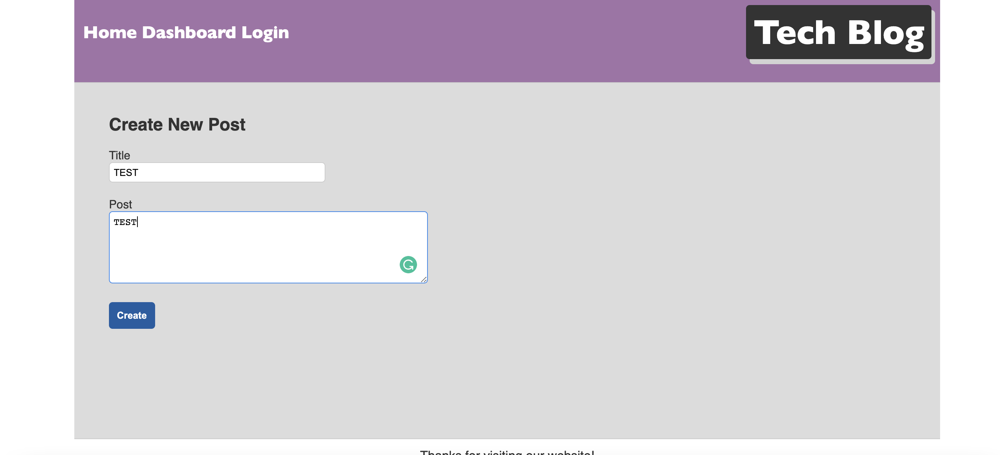
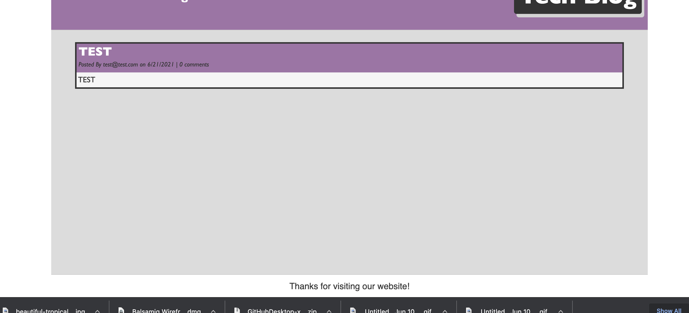
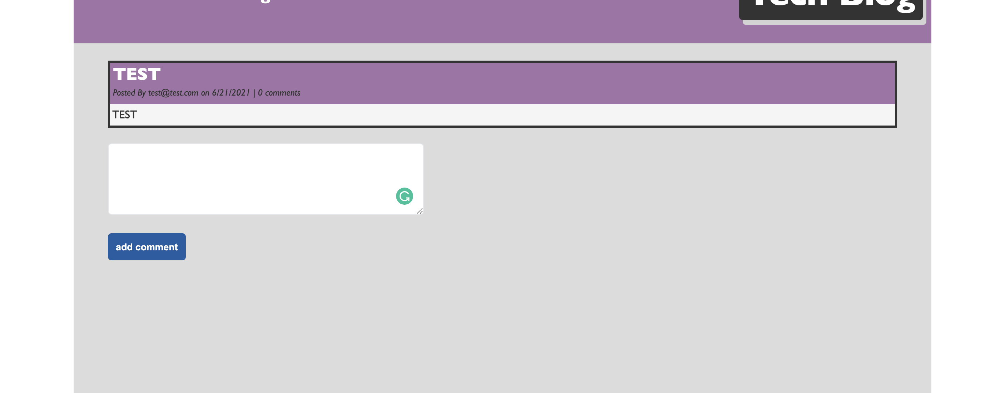
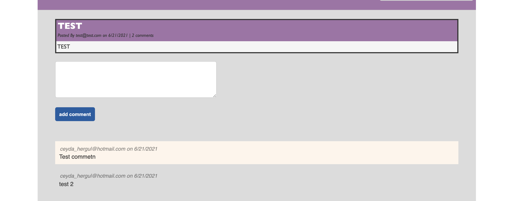

# 14 Model-View-Controller (MVC): Tech Blog

The application contained within is a CMS-style blog site similar to a Wordpress website. You can publish your blog posts and comment on other users posts as well. The app follows the MVC paradigm in its architectural structure, using Handlebars.js as the templating language, Sequelize as the ORM, and the express-session npm package for authentication.

You can clone this repo.

git clone https://github.com/chergul/tech-blog.git

There are no tests for this application.
​
​
## Video for the app
​
1-Login or sign up

2-Create new post

3-Posts

4-Add comment

5-Comments

## For heroku deployment

https://thawing-ocean-97036.herokuapp.com/

## Questions
If you have any questions about this repo, you can open an issue, or contact directly at 
ceyda_hergul@hotmail.com

Pull requests are welcome
​

